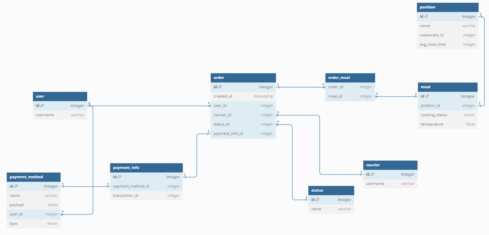

# ДЗ 1
## Роли:
- Менеджер ресторана - меняет статусы конкретного блюда (`meal`)
- Курьер - "берет" заказ. В заказе может храниться какой-нибудь `optimal_route_id` но, думаю, это не реалистично
- Юзер - взаимодействует с `positions` (позициями в меню) и при оформлении заказа создается новое блюдо соответствующее блюду в меню

## Другие пояснения:
- Статусы заказов хранится в отдельной табличке, чтобы можно было безболезненно расширить жизненный цикл заказа
- У юзера может быть сохранено несколько методов оплаты, но к заказу приклрепляется только один - использованный

## Схема


## Автосгенеренный MySQL код (не тестил)
```sql
CREATE TABLE `status` (
  `id` integer PRIMARY KEY,
  `name` varchar(255)
);

CREATE TABLE `order` (
  `id` integer PRIMARY KEY,
  `created_at` timestamp,
  `user_id` integer,
  `courier_id` integer,
  `status_id` integer,
  `payment_info_id` integer
);

CREATE TABLE `order_meal` (
  `order_id` integer,
  `meal_id` integer
);

CREATE TABLE `user` (
  `id` integer PRIMARY KEY,
  `username` varchar(255)
);

CREATE TABLE `courier` (
  `id` integer PRIMARY KEY,
  `username` varchar(255)
);

CREATE TABLE `position` (
  `id` integer PRIMARY KEY,
  `name` varchar(255),
  `restaurant_id` integer,
  `avg_cook_time` integer
);

CREATE TABLE `payment_method` (
  `id` integer PRIMARY KEY,
  `name` varchar(255),
  `payload` bytes,
  `user_id` integer,
  `type` enum
);

CREATE TABLE `meal` (
  `id` integer PRIMARY KEY,
  `position_id` integer,
  `cooking_status` enum,
  `temperature` float
);

CREATE TABLE `payment_info` (
  `id` integer PRIMARY KEY,
  `payment_method_id` integer,
  `transaction_id` integer
);

ALTER TABLE `order_meal` ADD FOREIGN KEY (`order_id`) REFERENCES `order` (`id`);

ALTER TABLE `order_meal` ADD FOREIGN KEY (`meal_id`) REFERENCES `meal` (`id`);

ALTER TABLE `order` ADD FOREIGN KEY (`user_id`) REFERENCES `user` (`id`);

ALTER TABLE `order` ADD FOREIGN KEY (`courier_id`) REFERENCES `courier` (`id`);

ALTER TABLE `order` ADD FOREIGN KEY (`status_id`) REFERENCES `status` (`id`);

ALTER TABLE `payment_method` ADD FOREIGN KEY (`user_id`) REFERENCES `user` (`id`);

ALTER TABLE `payment_info` ADD FOREIGN KEY (`payment_method_id`) REFERENCES `payment_method` (`id`);

ALTER TABLE `position` ADD FOREIGN KEY (`id`) REFERENCES `meal` (`position_id`);

ALTER TABLE `order` ADD FOREIGN KEY (`payment_info_id`) REFERENCES `payment_info` (`id`);

```
